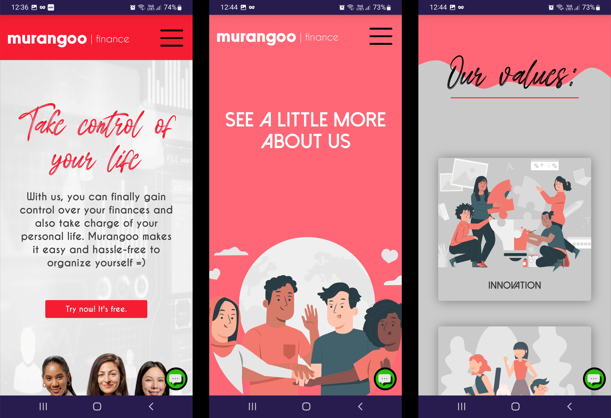
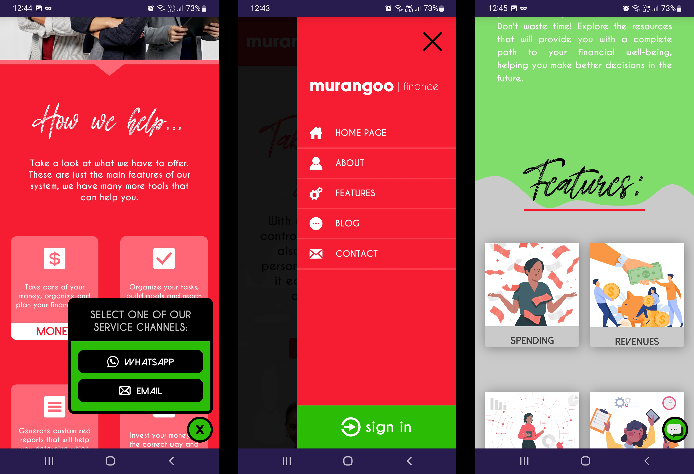
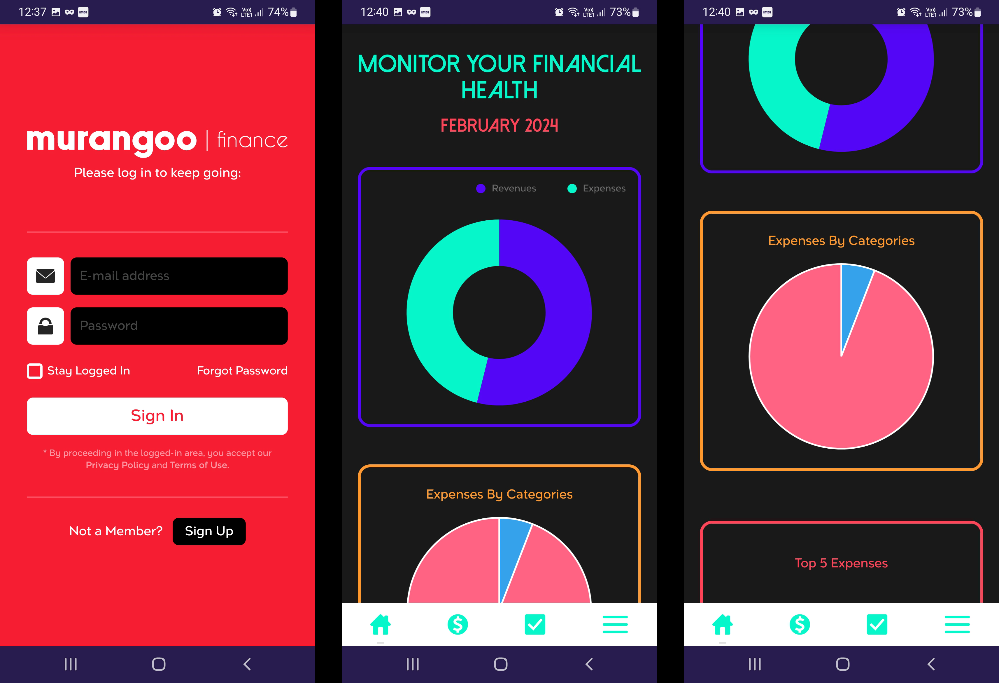
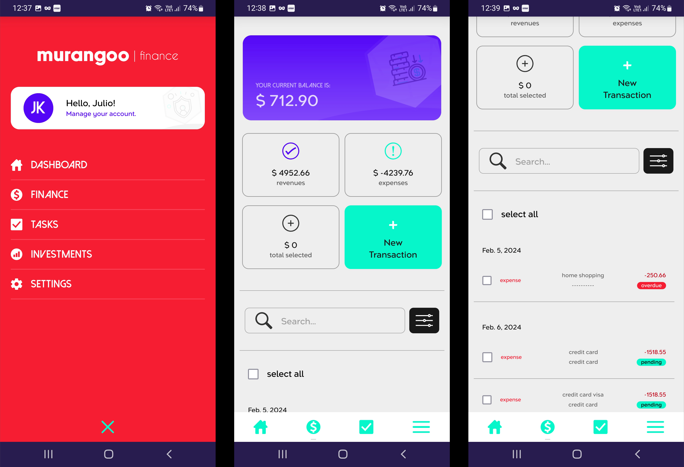
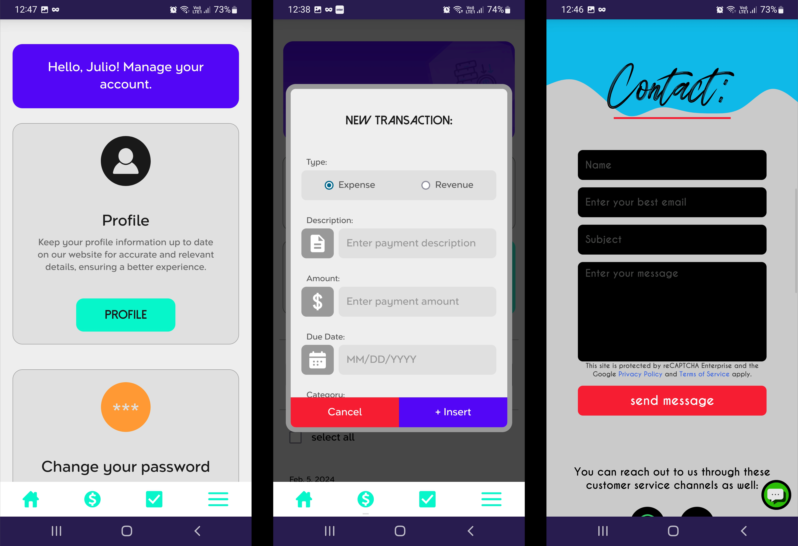

# Murangoo Finance

Murangoo Finance is a financial management platform designed to meet modern financial control needs. With its responsive web application, users can access their accounts and perform financial control tasks from any device, whether it's a desktop computer, tablet, or smartphone.

<iframe width="560" height="315" src="https://www.youtube.com/embed/zFoXgpDrT24?si=iGHoBvpOyONzN0e6" title="YouTube video player" frameborder="0" allow="accelerometer; autoplay; clipboard-write; encrypted-media; gyroscope; picture-in-picture; web-share" allowfullscreen></iframe>

## Mobile (Responsive Web Application)

    
    
    
    
    

Furthermore, Murangoo Finance offers comprehensive account control features, allowing users to track their expenses, income, and balances in real-time, providing a clear and organized view of their finances. In addition to this, the platform also provides functionalities for task and investment control, offering a complete and integrated solution for managing personal and professional finances efficiently and conveniently.

Moreover, Murangoo Finance offers a range of advanced features to ensure users' security and convenience. With its anti-brute force functionality, the platform protects users' accounts against unauthorized access attempts, automatically detecting and blocking suspicious activities. Additionally, the option to use email as a login simplifies the access process, eliminating the need to memorize additional usernames.

Internationalization, or translation, is another important feature of Murangoo Finance, allowing users to customize the experience according to their language preferences. With support for multiple languages, users can enjoy the platform in their native language, making it accessible and easy to use for a wide range of users worldwide. The responsiveness of the web application ensures a consistent experience across all devices, from desktop computers to smartphones and tablets, ensuring users can access and manage their finances anywhere, anytime.

Finally, Murangoo Finance offers additional features such as CAPTCHA for additional protection against bots and unauthorized access, and the option of double-verification account deletion to ensure users can safely delete their accounts. The intuitive dashboard and user-friendly interface provide a pleasant and efficient user experience, allowing users to easily view their financial information and perform management tasks with ease. With professional authentication by Allauth and the use of PostgreSQL as the database, Murangoo Finance offers a robust and reliable solution for personal and business financial management.
